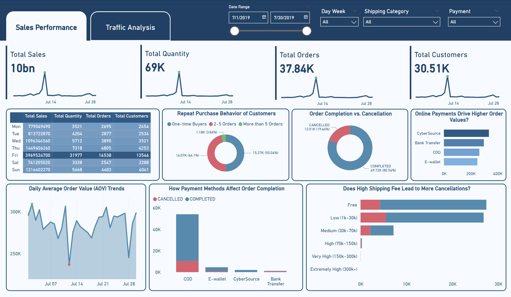

# Seller A Revenue Analysis and KPI Achievement Plan
This project provides an analysis of Seller A’s historical sales and traffic data to develop a strategy to double gross revenue from 10B VND in July to 20B VND in August. The repository includes a dashboard and a presentation slide deck summarizing key findings and actionable recommendations.

# Project Overview
In this analysis, we:

- Buid a dashboard by `Power BI` to identify key insights from the provided datasets.

- Analyzed patterns in historical sales performance and traffic source data.

- Proposed an action plan designed to achieve the August KPI of 20B VND in gross revenue.

# Dataset Description
The analysis is based on two main datasets:

- Order Data: Historical sales data from the Order Management System, containing details on order quantity, pricing, payment methods, and voucher usage.

- Traffic Data: Google Analytics data on traffic sources, sessions, users, bounce rates, and conversion rates.

_Note: Data provided is sample data and is intended for testing purposes only._

# About Dashboard
The Sales & Traffic Dashboard provides an insightful analysis of sales performance and traffic sources over the specified date range. It is divided into two main sections:

  1. **Sales Performance**
  This section captures essential metrics, including:
  
  - Total Sales: 10 billion
  - Total Quantity Sold: 69,000
  - Total Orders: 37,840
  - Total Customers: 30,510
  
  It also analyzes order completion versus cancellation rates, showcasing the effectiveness of various payment methods. Users can track daily sales trends, identifying peak days for sales activity and understanding customer purchasing behavior.

2. **Traffic Analysis**
  This section evaluates the effectiveness of different traffic sources in driving revenue, with a total of 3 million sessions and 1 million users. Key insights include:
  
  - **Traffic Breakdown by Type:** Highlights the contributions from paid search, social media, direct visits, and more.
  - **Revenue by Traffic Source:** Identifies which channels generate the most revenue, with paid search leading at 10.1 billion.
  - **User Engagement Metrics:** Includes average session duration and bounce rates, providing insights into customer retention across various traffic sources.
  
  Together, these sections equip users with the necessary data to make informed decisions, optimize sales strategies, and enhance customer retention efforts.
  
  

# Key Findings

- Revenue Trends: Analysis of high-revenue days and factors contributing to peak performance.

- Traffic Performance: Identification of top-performing traffic sources with high conversion rates and low bounce rates.

- Conversion Optimization: Observations on the impact of specific payment methods and voucher usage on order completion and revenue.

# Conclusion
This project serves as a guide for developing a data-driven action plan to achieve substantial revenue growth for Seller A. By leveraging insights from historical data, this approach highlights practical actions focused on optimizing traffic sources, enhancing user engagement, and maximizing conversion rates.
